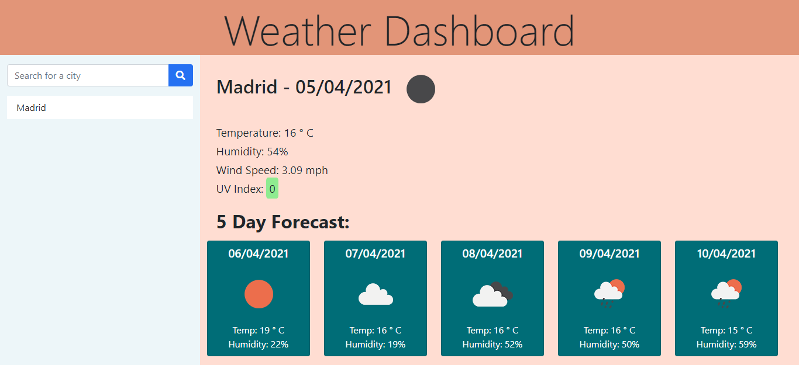

<h1>Weather Dashboard</h1>

<h2> Table of Contents </h2>

- [Project Link](#project-link)
- [About the Project](#about-the-project)
- [Additional Features Included](#additional-features-included)
- [Screenshots](#screenshots)
  - [Welcome screen](#welcome-screen)
  - [Full screen image of city search](#full-screen-image-of-city-search)
  - [Screenshot showing local storage](#screenshot-showing-local-storage)
  - [Error Message + Network Error](#error-message--network-error)

## Project Link

Click [here](https://natasha-mann.github.io/weather-dashboard/) to view the project on GitHub pages.

## About the Project

For this project I created a weather dashboard, using the openweathermap API to display weather data based on a city searched by the user. I coded this application from scratch and built up the HTML, CSS and Javascript accordingly.

When a user searches for a city, the current day's weather for that city is displayed on screen, along with the forecast for the next 5 days. All searched cities are saved in local storage and displayed on the screen. The user is able to click on the previous search entries to retrieve the weather data. On load of the app, the weather for the most recently searched city is stored.

## Additional Features Included

- Logic to format the user searches to all lower case when stored in local storage and then to add an initial capital when rendered on the page.
- Logic to ensure that a city is only added to storage if it is not already present.
- Logic to sort the saved search array so that most recent searches are displayed at the top of the rendered list.
- Error handling for "bad searches" which displays an error message on screen for the user.

## Screenshots

### Welcome screen

### Full screen image of city search

### Screenshot showing local storage

### Error Message + Network Error

